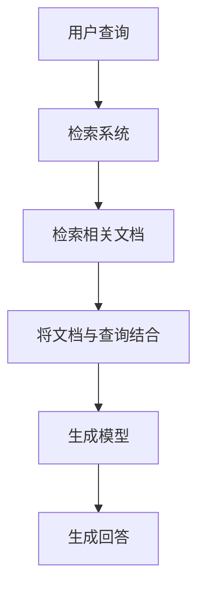

# 为什么需要RAG（检索增强生成）

随着大语言模型的快速发展，我们面临着知识时效性和准确性的挑战。RAG（Retrieval-Augmented Generation，检索增强生成）技术应运而生，它结合了检索系统和生成模型的优点，为AI应用带来了革命性的改进。

## 大模型的局限性

传统的大语言模型存在几个明显的局限性：

1. **知识截止日期**：模型训练完成后，无法获取最新信息
2. **事实准确性**：模型可能产生"幻觉"，编造不存在的信息
3. **领域专业性**：在特定专业领域，模型可能缺乏深度知识
4. **实时性**：无法处理实时变化的数据

## RAG的工作原理

RAG通过以下步骤解决这些问题：

1. **检索阶段**：当用户提出问题，系统首先从知识库中检索相关文档
2. **增强阶段**：将检索到的文档与用户查询结合
3. **生成阶段**：基于增强的信息生成回答

## RAG的优势

**1. 知识更新及时**

RAG系统能够实时检索最新信息，不受模型训练时间的限制。例如，当有新的技术文档发布时，只需更新知识库即可，无需重新训练模型。

**2. 事实准确性提升**

通过引用真实文档作为依据，RAG显著减少了"幻觉"现象。生成的回答通常会附带引用来源，提高了可信度。

**3. 领域专业性增强**

对于特定领域，可以构建专门的检索库，使模型在专业问题上表现更出色。医疗、法律等敏感领域特别受益。

**4. 成本效益**

相比重新训练大模型，维护检索系统成本更低，且更新更灵活。

## 应用场景

RAG在多个领域展现出强大能力：

- **企业知识管理**：整合内部文档，提供即时问答
- **实时信息查询**：如股票价格、新闻动态等
- **专业领域咨询**：医疗诊断、法律咨询等
- **多语言支持**：通过检索不同语言的文档提供服务

## 实现挑战

尽管RAG优势明显，但也面临一些挑战：

1. **检索质量**：如何准确找到相关文档
2. **上下文长度**：处理长文档和复杂查询
3. **计算成本**：检索和生成的资源消耗
4. **隐私安全**：敏感信息的处理

## 未来展望

RAG技术正在不断演进，未来可能会：

- 与多模态模型结合，处理图像、音频等多种数据
- 实现更智能的检索策略
- 降低部署门槛，使更多应用场景受益

RAG不仅是一种技术，更是推动AI向更实用、更可靠方向发展的关键一步。它让AI能够更好地服务于人类，解决实际问题。

作者：[Herrylo](https://github.com/Herrylo)